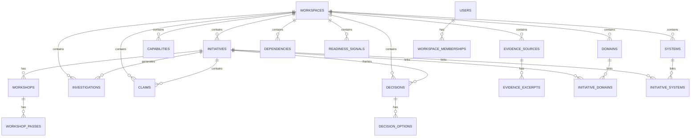

# Pandora Transformation Workbench — v0 Build Specification

**Document status:** Build-ready specification for engineering  
**Primary use:** Human engineering handoff + direct input to Claude Code / AI-assisted build tools  
**Default target:** Single-workspace internal portal, optimized for 1920×1080 desktop usage  
**Version:** v0.1  
**Date:** 2026-03-23

---

## 1. What this spec is

This document translates the existing **Transformation Workbench Blueprint** into an executable product specification.

The blueprint is already strong on:
- the core challenge of many initiatives converging on shared domains,
- the three reasoning lenses of **Decision**, **Dependency**, and **Readiness**,
- the idea of **six reasoning surfaces**,
- a structured **object base** plus **intelligence pipeline**,
- an initiative-by-initiative **draft → workshop → reconcile** operating model,
- and persona-based navigation.

This spec turns that into:
- concrete product surfaces,
- canonical objects,
- relational schema,
- permissions,
- workflows,
- page map,
- UI system constraints,
- API boundaries,
- implementation phases,
- and explicit placeholders for future depth.

This is **not** a narrowed-down MVP memo.  
Where something is not being fully built in v0, it is still called out here as a placeholder so we do not accidentally erase future intent.

---

## 2. Product thesis

The Transformation Workbench is a **decision-support and transformation-legibility platform**.

It exists to make a complex transformation landscape easier to reason about before execution complexity compounds.

The workbench must let users:
1. understand one initiative in depth,
2. see how that initiative connects to others,
3. identify hidden dependencies and sequence implications,
4. assess readiness across systems, capabilities, and operating domains,
5. surface unresolved investigations,
6. reconcile conflicting claims across workshops,
7. move from scattered source material to a structured, navigable intelligence base.

---

## 3. Product principles

1. **Initiative-first, landscape-aware**  
   Work starts with one initiative packet, but every initiative must be connected to the wider landscape.

2. **Object-backed, not slide-backed**  
   The workbench is not a document repository with a nicer UI. It is an object model with evidence and views.

3. **Human-corrected intelligence**  
   AI may assist with extraction, suggestion, summarisation, and linking. Human review determines truth.

4. **Reasoning over reporting**  
   The platform should help people ask better questions and trace implications, not just display status.

5. **Evidence and provenance are first-class**  
   Every material claim should be traceable to a source, a workshop, or an owner.

6. **Nothing important disappears because v0 is thin**  
   Any capability not fully implemented in v0 must be preserved as a schema-level or surface-level placeholder.

---

## 4. Explicit interpretation decisions

The blueprint intentionally leaves some things high-level. This spec makes the following decisions so engineering can proceed.

### 4.1 Source-of-truth object
The primary source-of-truth object is **Initiative**.

Everything else links back directly or indirectly to initiative context:
- decisions,
- dependencies,
- readiness signals,
- investigations,
- workshop outputs,
- evidence,
- claims,
- journeys.

### 4.2 Product naming
The blueprint names “six reasoning surfaces” but does not lock product-facing names.  
This spec defines those names now so engineering can build coherent navigation.

### 4.3 Delivery posture
v0 is a **real internal portal**, not a prototype deck.
It must support:
- authentication,
- access control,
- object creation/editing,
- auditability,
- evidence attachment,
- filtering,
- graph traversal,
- and seeded example data.

### 4.4 Tenant posture
v0 supports **one workspace / one organisational boundary**.
The schema must remain **tenant-ready** for later multi-workspace expansion.

### 4.5 AI posture
AI is a **supporting layer**, not the authority.
v0 should preserve hooks for:
- extraction from source documents,
- claim suggestions,
- entity linking,
- duplicate detection,
- and summarisation,
but the first build must work even if AI is disabled.

---

## 5. Target users and primary user roles

### Core roles
- **Workspace Admin** — full control across workspace, settings, permissions, schema-backed admin tasks.
- **Programme Lead** — oversees landscape, can edit most transformation objects, can reconcile disputes.
- **Initiative Owner** — owns one or more initiative packets, can create and validate objects within assigned scope.
- **Workstream Lead** — contributes initiative-specific detail, decisions, dependencies, readiness inputs.
- **Contributor / Analyst** — can draft, annotate, attach evidence, propose edits.
- **Reviewer** — can review, comment, dispute, validate; limited create/delete powers.
- **Viewer / Executive** — read-only access to permitted surfaces and saved views.
- **External Partner** (placeholder) — limited invited access to selected initiatives or workshop packets.

### Persona journeys
Persona journeys are not separate products; they are **role-shaped paths through the same six surfaces**.
Example:
- executive: Landscape Overview → Decision Studio → Readiness Radar
- initiative owner: Initiative Workspace → Dependency Map → Investigation Hub
- analyst: Initiative Workspace → Reconciliation Hub → Evidence / Claims

---

## 6. Six product surfaces

All six surfaces must exist in the product model now, even if some are initially thinner than others.

| Surface | Product purpose | Primary users | v0 depth |
|---|---|---|---|
| 1. Landscape Overview | Portfolio-wide entry point showing initiatives, hotspots, shared domains, cross-initiative stress | Executives, programme leads | Full |
| 2. Initiative Workspace | Canonical workspace for one initiative packet: summary, source material, decisions, domains, systems, workshop outputs | Initiative owners, analysts, leads | Full |
| 3. Decision Studio | Structured view of decisions, options, trade-offs, owners, status, affected objects | Initiative owners, programme leads | Full |
| 4. Dependency Map | Graph and list views for cross-initiative, system, capability, and domain dependencies | Leads, analysts, architects | Full |
| 5. Readiness Radar | Readiness signals across architecture, system preparedness, capability maturity, dependency maturity, org/process readiness | Leads, architects, operations | Full |
| 6. Investigation & Reconciliation Hub | Queue of open investigations, disputed claims, workshop passes, unresolved conflicts, reconciliation actions | Analysts, programme leads, reviewers | Full |

### 6.1 Surface 1 — Landscape Overview
**Purpose**  
Provide a legible cross-initiative overview of the transformation landscape.

**Must show**
- initiatives in scope,
- status of each initiative packet,
- shared domains under stress,
- most critical decisions awaiting confirmation,
- most severe validated dependencies,
- readiness hotspots,
- open investigations count,
- latest workshop activity,
- saved views by persona.

**Primary widgets**
- initiative card grid,
- portfolio timeline / sequencing strip,
- hotspot summary,
- domain convergence panel,
- recent changes activity feed,
- cross-initiative graph teaser.

**Core actions**
- open initiative packet,
- filter by domain / programme / owner / maturity,
- create new initiative,
- save view,
- open dependency or readiness hotspots.

### 6.2 Surface 2 — Initiative Workspace
**Purpose**  
Serve as the canonical home of one initiative packet.

**Must show**
- initiative summary,
- business objective,
- adjacent initiatives,
- assumed and validated shared domains,
- known unknowns,
- major decisions,
- systems and capabilities surfaced,
- readiness summary,
- investigations,
- workshop history,
- evidence sources.

**Primary layout**
- hero summary strip,
- tabbed subviews,
- split canvas with context drawer,
- evidence panel,
- workshop progression panel.

**Subtabs**
- Overview
- Decisions
- Dependencies
- Readiness
- Investigations
- Evidence
- Workshop History
- Activity / Audit

### 6.3 Surface 3 — Decision Studio
**Purpose**  
Turn decisions into structured objects rather than buried bullets.

**Must show**
- decision statement,
- decision type,
- owner,
- status,
- options,
- rationale,
- affected initiatives,
- affected domains/capabilities/systems,
- blocking dependencies,
- linked investigations,
- supporting evidence,
- confidence level.

**Primary actions**
- create decision,
- add options,
- assign owner,
- link affected objects,
- mark as disputed / confirmed / superseded,
- attach evidence,
- create follow-up investigation.

### 6.4 Surface 4 — Dependency Map
**Purpose**  
Expose ripple effects and hidden couplings.

**Must show**
- initiative-to-initiative dependencies,
- decision-to-system impacts,
- capability-to-system links,
- shared domain stress points,
- dependency type,
- strength / confidence,
- directionality,
- current status.

**Modes**
- graph mode,
- table mode,
- adjacency mode,
- dependency chain mode,
- “what changed if this moves?” mode (placeholder).

**Primary actions**
- create dependency,
- validate / dispute dependency,
- change direction or severity,
- group by domain,
- trace shortest path between two objects,
- create saved graph views.

### 6.5 Surface 5 — Readiness Radar
**Purpose**  
Give a structured answer to “how prepared are we?”

**Readiness dimensions**
- architecture clarity,
- system preparedness,
- capability maturity,
- dependency maturity,
- organisational readiness,
- operational readiness,
- data readiness (placeholder),
- governance readiness (placeholder).

**Views**
- initiative heatmap,
- domain heatmap,
- system readiness grid,
- readiness trend over time (placeholder),
- gap list with owners.

**Primary actions**
- log readiness signal,
- score or classify readiness,
- attach evidence,
- create investigation from gap,
- compare readiness across initiatives or domains.

### 6.6 Surface 6 — Investigation & Reconciliation Hub
**Purpose**  
Manage uncertainty, contradiction, and unresolved work.

**Must show**
- investigation queue,
- triage state,
- owner,
- due date,
- linked objects,
- workshop pass that generated it,
- disputed claims,
- conflict resolution suggestions (placeholder),
- reconciliation batches,
- resolved vs unresolved counts.

**Primary actions**
- create investigation,
- assign / reassign,
- mark blocked,
- resolve with evidence,
- reconcile conflicting claims,
- merge duplicate investigations,
- publish reconciliation outcome back to object base.

---

## 7. Canonical object model

The workbench is object-backed. Each object needs:
- durable ID,
- lifecycle state,
- owner / steward,
- provenance,
- timestamps,
- confidence / validation state where relevant,
- links to other objects.

### 7.1 Core objects

| Object | Why it exists | Must exist in v0 UI | Notes |
|---|---|---|---|
| Initiative | Primary planning and reasoning container | Yes | Source-of-truth anchor |
| Domain | Shared transformation domain affected by one or more initiatives | Yes | Example: Planning, Inventory |
| Capability | Business or operational capability | Yes | Can be linked to domains and systems |
| System | Application / platform / backbone / tool | Yes | Supports readiness and dependency mapping |
| Decision | Choice requiring framing and traceability | Yes | Needs owner, options, status |
| Dependency | Explicit relationship where one object affects another | Yes | Graph backbone |
| Readiness Signal | Structured assessment of preparedness | Yes | Supports heatmaps |
| Investigation | Open question or unresolved analysis item | Yes | Queue object |
| Workshop | Session or bounded event generating structured outputs | Yes | Parent object for passes |
| Workshop Pass | Clarify / dependency / readiness pass or later custom pass | Yes | Enables consistent progression |
| Claim | A discrete assertion extracted from source material or workshops | Yes | Can be validated/disputed |
| Evidence Source | Uploaded or linked raw material | Yes | Deck, transcript, doc, note |
| Evidence Excerpt | Specific quoted or linked excerpt from a source | Yes | Fine-grained provenance |
| Journey Template | Persona-specific entry pattern or route through surfaces | Placeholder | Preserve now, thin UI later |

### 7.2 Supporting objects

| Object | Purpose | v0 depth |
|---|---|---|
| User | Authenticated person | Full |
| Team | Grouping for permission or ownership | Full |
| Role Assignment | RBAC mapping | Full |
| Comment | Discussion and review context | Full |
| Attachment | File-level or asset-level attachment | Full |
| Tag | Lightweight categorisation | Full |
| Saved View | Reusable filter + layout state | Full |
| Audit Event | Immutable change tracking | Full |
| Notification | System/user-triggered alert | Placeholder |
| Task / Action Item | Structured follow-up work item | Placeholder |
| Milestone | Sequence and timeline anchor | Placeholder |
| Scenario | Future-state option set for comparative reasoning | Placeholder |
| Metric | Quantitative tracked signal | Placeholder |
| Glossary Term | Shared vocabulary | Placeholder |
| Connector | External system integration definition | Placeholder |

### 7.3 Placeholder rule
If an object is marked placeholder:
- its table or schema shell should still exist where useful,
- relation hooks should be anticipated,
- the UI may expose only a minimal listing or nothing at all,
- the product should not structurally block later activation.

---

## 8. Relationship model

The data model must support both:
1. strongly typed relations, and
2. a generic graph layer.

### 8.1 Typed relationships
Examples:
- initiative **touches** domain
- initiative **uses / changes / depends_on** system
- decision **affects** capability
- dependency **links** source object to target object
- readiness signal **assesses** initiative / system / capability / domain
- investigation **concerns** one or more objects
- claim **supported_by** evidence excerpt
- workshop pass **produces** claims, dependencies, signals, investigations

### 8.2 Generic graph layer
A generic `entity_links` table must exist to allow:
- future graph exploration,
- new relation types without schema surgery,
- mixed-object traversal,
- saved graph views,
- lineage and provenance traversal.

### 8.3 Canonical relationship rules
- every object may link to many other objects,
- relation type must be explicit,
- directionality must be explicit where meaningful,
- confidence / validation state should live either on the relation or on the object depending on context,
- relation provenance must be traceable.

---

## 9. Lifecycle model

The platform needs a coherent state model.  
Use a common pattern with object-specific subsets.

### 9.1 Shared state vocabulary
- draft
- proposed
- in_review
- validated
- disputed
- resolved
- superseded
- archived

### 9.2 Object-specific lifecycle recommendations

#### Initiative
- draft
- workshop_ready
- in_workshop
- reconciled
- active
- parked
- archived

#### Decision
- candidate
- framed
- in_review
- confirmed
- disputed
- superseded
- archived

#### Dependency
- hypothesised
- observed
- validated
- disputed
- retired

#### Readiness Signal
- missing
- captured
- reviewed
- validated
- stale
- archived

#### Investigation
- queued
- triaged
- in_progress
- blocked
- answered
- closed
- archived

#### Claim
- extracted
- proposed
- validated
- disputed
- rejected
- archived

#### Workshop
- planned
- in_progress
- completed
- reconciled
- archived

---

## 10. Confidence, validation, and provenance

This is a critical design decision.

### Every material object should support:
- **confidence score** (0–100 or low/medium/high),
- **validation state**,
- **source provenance**,
- **last reviewer**,
- **last reviewed at**.

### Rules
1. Claims can exist before validation.
2. Dependencies may begin hypothesised.
3. Readiness signals can be partial or stale.
4. A decision may be “framed” even before it is confirmed.
5. Evidence can support multiple claims.
6. Provenance must remain visible in the UI, not buried.

---

## 11. Role and permission model

Use RBAC with row-level security and light ABAC conditions.

### 11.1 Role definitions

| Role | Read | Create | Edit | Delete | Validate / Reconcile | Admin |
|---|---|---|---|---|---|---|
| Workspace Admin | All | All | All | All | All | Yes |
| Programme Lead | Most | Most | Most | Limited | Yes | Limited |
| Initiative Owner | Assigned + linked | Assigned scope | Assigned scope | Limited | Limited | No |
| Workstream Lead | Assigned scope | Assigned scope | Assigned scope | No | Propose only | No |
| Contributor | Permitted scope | Yes | Own / assigned | No | No | No |
| Reviewer | Permitted scope | Limited | Comment / review edits | No | Yes on reviewable objects | No |
| Viewer | Permitted scope | No | No | No | No | No |
| External Partner | Explicitly shared objects only | No or limited | Limited if enabled | No | No | No |

### 11.2 Access dimensions
Permissions should be enforceable by:
- workspace,
- role,
- assignment to initiative,
- sensitivity flag,
- object ownership,
- invited collaborator list (placeholder),
- internal vs external visibility flag.

### 11.3 Recommended RLS model
- store user-workspace memberships,
- store initiative assignments,
- store object visibility and ownership,
- enforce read/write policies at table level in Postgres / Supabase RLS,
- use service role only for background ingestion and admin operations.

---

## 12. Draft → workshop → reconcile operating model

This workflow is central to the workbench.

### Phase A — Draft
Input:
- decks,
- diagrams,
- transcripts,
- trackers,
- planning notes,
- manual analyst input.

Output:
- initiative packet v0,
- provisional claims,
- tentative domains,
- known unknowns,
- early decisions,
- hypothesised dependencies,
- initial readiness gaps.

### Phase B — Workshop
Each initiative should support repeatable workshop passes.

#### Default workshop passes
1. **Clarify the initiative**
   - objective,
   - scope,
   - rollout or scenario choice,
   - core systems/capabilities,
   - assumptions,
   - ownership.

2. **Map outward dependencies**
   - adjacent initiatives,
   - shared domains,
   - upstream/downstream impacts,
   - decision implications,
   - coupling severity.

3. **Assess readiness and investigations**
   - architecture clarity,
   - mapping completeness,
   - capability/system preparedness,
   - open investigations,
   - missing evidence.

### Phase C — Reconcile
Cross-initiative step after one or more workshops:
- align conflicting claims,
- merge duplicate domains or systems where needed,
- validate or dispute dependencies,
- surface hotspots,
- roll up readiness gaps,
- update landscape view.

### Workflow implementation requirement
This workflow must be a **first-class product flow**, not just documentation.
The system must store:
- draft version,
- workshop passes,
- reconciliation events,
- resulting object changes,
- published state.

---

## 13. Page map and navigation

### 13.1 Global navigation
Recommended left rail:
1. Landscape Overview
2. Initiatives
3. Decisions
4. Dependencies
5. Readiness
6. Investigations
7. Evidence Library
8. Saved Views
9. Admin
10. Settings

### 13.2 Default shell
- Left navigation rail
- Top command / search / context bar
- Main canvas
- Optional right context drawer
- Optional bottom timeline or activity strip

### 13.3 Initiative route structure
`/initiatives/:initiativeId`
with nested routes:
- `/overview`
- `/decisions`
- `/dependencies`
- `/readiness`
- `/investigations`
- `/evidence`
- `/workshops`
- `/activity`

### 13.4 Portfolio route structure
- `/landscape`
- `/decisions`
- `/dependencies`
- `/readiness`
- `/investigations`
- `/evidence`
- `/admin`

---

## 14. UI / UX specification

## 14.1 Product posture
This is an **application shell**, not an editorial website.
Use the full desktop width and height meaningfully.

### 14.2 Default viewport target
- Primary design target: **1920 × 1080**
- Secondary: 1600 × 900
- Tertiary: 1440 × 900
- Tablet and mobile are not primary v0 targets, but layout should degrade gracefully.

### 14.3 Layout model
Use a full-width shell:
- Left rail: 256–280 px
- Top command bar: 64–72 px
- Right context drawer: 320–380 px
- Main working canvas: flexible remainder
- Internal panels and text blocks may still use readable width caps

### 14.4 Important interpretation of the Pandora design system
The Pandora design system calls for a web max content width of 1200 px for centered content.  
That should be applied to **editorial or narrative blocks**, not to the whole application shell.  

For the workbench:
- use **full-bleed app chrome**,
- use **contained readable modules inside the canvas**,
- keep narrative text cards at readable widths,
- allow data-rich surfaces (graphs, matrices, split views) to use the broader canvas.

### 14.5 Screen patterns
- overview dashboards,
- split-pane analysis screens,
- tabbed initiative workspaces,
- graph explorer,
- heatmaps,
- evidence drawer,
- change log drawer,
- form modals and full-page editors.

### 14.6 Form posture
Object creation and editing should use:
- drawer or modal for light edits,
- full-page editor for heavy objects such as initiative packets or decisions with many linked fields.

### 14.7 Empty states
Every surface must have meaningful empty states:
- what this surface is for,
- what can be created here,
- suggested next action,
- optional seed examples.

### 14.8 Search and filtering
Global search must search across:
- initiatives,
- decisions,
- systems,
- capabilities,
- domains,
- investigations,
- evidence sources,
- claims.

Faceted filters should support:
- owner,
- status,
- confidence,
- validation state,
- domain,
- initiative,
- time updated,
- workshop cycle,
- linked system,
- linked capability.

---

## 15. Pandora-specific design system implementation

The product must follow the uploaded Pandora universal design system.

### 15.1 Tone
Three words:
- Warm
- Restrained
- Purposeful

### 15.2 Colour tokens
Use these as the foundation:
- Background: `#FFFFFF`
- Surface: `#F9F5F2`
- Text primary: `#2D2926`
- Text secondary: `#6B5E57`
- Text tertiary: `#4A3F3A`
- Accent primary: `#E8B4BC`
- Accent dark: `#8C545E`
- Accent medium: `#B06B78`
- Accent soft: `#D4B8BD`
- Dark background: `#2D2926`
- Dark text: `#FFFFFF`

### 15.3 Type system
- Headings: Cormorant Garamond or equivalent elegant serif
- Body: Source Sans 3 or equivalent humanist sans
- Body should feel open and light
- Overlines should be uppercase, wide-tracked, pink or muted rose

### 15.4 Interaction posture
- calm transitions,
- no loud motion,
- restrained hover states,
- pink used as a whisper, not a shout,
- equal visual treatment for equal items.

### 15.5 App-specific design rules
1. Do not use cold greys.
2. Do not use pure black.
3. Use cards and panels consistently.
4. Use dark charcoal only for anchor sections, not everywhere.
5. Keep graphs elegant and quiet.
6. Keep iconography outline-based and mono-weight.
7. Use generous spacing; never cram dashboards.

### 15.6 Component guidance for the portal
#### Cards
- warm cream background,
- powder pink border,
- 8 px radius,
- soft shadow,
- 24 px internal padding.

#### Buttons
- primary dark charcoal with white text,
- secondary transparent with pink border,
- no bright coloured CTA palette.

#### Tags and pills
- soft pink translucent fills,
- fully rounded,
- body font,
- small but readable.

#### Graph edges
- default edge colour should lean soft rose / taupe, not loud blue/green/red.
- alerts may use dusty rose emphasis when necessary.

---

## 16. Information architecture by object

### 16.1 Initiative object
**Fields**
- id
- workspace_id
- slug
- name
- short_name
- description
- objective
- status
- lifecycle_state
- owner_user_id
- sponsor_user_id (placeholder)
- programme
- priority
- business_value_summary
- scope_summary
- known_unknowns (jsonb or child records)
- notes
- created_at
- updated_at
- archived_at

### 16.2 Domain object
**Fields**
- id
- workspace_id
- name
- description
- domain_type
- owner_user_id (placeholder)
- status
- metadata

### 16.3 Capability object
**Fields**
- id
- workspace_id
- name
- description
- capability_type
- status
- parent_capability_id (placeholder for hierarchy)
- metadata

### 16.4 System object
**Fields**
- id
- workspace_id
- name
- description
- system_type
- vendor
- lifecycle
- status
- criticality
- metadata

### 16.5 Decision object
**Fields**
- id
- workspace_id
- initiative_id
- title
- statement
- decision_type
- owner_user_id
- status
- due_date
- confidence
- rationale
- implications_summary
- validation_state
- created_at
- updated_at

### 16.6 Decision Option object
**Fields**
- id
- decision_id
- label
- description
- pros
- cons
- estimated_complexity
- estimated_risk
- recommended_flag
- status

### 16.7 Dependency object
**Fields**
- id
- workspace_id
- source_entity_type
- source_entity_id
- target_entity_type
- target_entity_id
- dependency_type
- direction
- severity
- confidence
- status
- rationale
- discovered_in_workshop_pass_id
- created_at
- updated_at

### 16.8 Readiness Signal object
**Fields**
- id
- workspace_id
- assessed_entity_type
- assessed_entity_id
- dimension
- score_numeric (nullable)
- score_band
- status
- confidence
- rationale
- owner_user_id
- captured_from_workshop_pass_id
- reviewed_at
- stale_after_at
- metadata

### 16.9 Investigation object
**Fields**
- id
- workspace_id
- initiative_id (nullable)
- title
- question
- category
- priority
- status
- owner_user_id
- due_date
- blocking_flag
- resolution_summary
- created_from_entity_type
- created_from_entity_id
- created_from_workshop_pass_id
- created_at
- updated_at

### 16.10 Workshop object
**Fields**
- id
- workspace_id
- initiative_id
- title
- workshop_type
- scheduled_at
- started_at
- completed_at
- status
- facilitator_user_id
- notes

### 16.11 Workshop Pass object
**Fields**
- id
- workshop_id
- pass_type
- sequence_number
- title
- objective
- status
- summary
- started_at
- completed_at

### 16.12 Claim object
**Fields**
- id
- workspace_id
- initiative_id (nullable)
- title
- statement
- claim_type
- confidence
- validation_state
- owner_user_id
- created_from_source_id
- created_from_workshop_pass_id
- created_at
- updated_at

### 16.13 Evidence Source object
**Fields**
- id
- workspace_id
- initiative_id (nullable)
- title
- source_type
- storage_path
- source_url
- mime_type
- uploaded_by_user_id
- uploaded_at
- ingestion_status
- extraction_status
- checksum
- metadata

### 16.14 Evidence Excerpt object
**Fields**
- id
- evidence_source_id
- excerpt_text
- page_ref
- slide_ref
- timestamp_ref
- locator_json
- created_at

---

## 17. Normalized relational schema

### 17.1 Required tables
- workspaces
- users
- teams
- workspace_memberships
- team_memberships
- initiatives
- domains
- capabilities
- systems
- decisions
- decision_options
- dependencies
- readiness_signals
- investigations
- workshops
- workshop_passes
- claims
- evidence_sources
- evidence_excerpts
- entity_links
- comments
- attachments
- tags
- entity_tags
- saved_views
- audit_events
- notifications (placeholder)
- tasks (placeholder)
- milestones (placeholder)
- scenarios (placeholder)
- metrics (placeholder)

### 17.2 Crosswalk tables
Need explicit many-to-many tables where typed relations matter:
- initiative_domains
- initiative_capabilities
- initiative_systems
- initiative_adjacent_initiatives
- decision_impacts
- investigation_entities
- claim_entities
- readiness_entities (optional if polymorphic not used)
- journey_surface_steps (placeholder)

### 17.3 Why both crosswalks and generic links?
Because:
- engineering benefits from explicit joins for known high-frequency queries,
- product benefits from generic graph traversal for future reasoning.

---

## 18. Suggested technical architecture

### 18.1 Recommended stack
- **Frontend:** Next.js 15, TypeScript, App Router
- **UI:** React, shadcn/ui primitives restyled to Pandora tokens
- **State / data fetching:** TanStack Query
- **Forms:** React Hook Form + Zod
- **Database:** Postgres
- **Backend platform:** Supabase
- **Auth:** Supabase Auth
- **Storage:** Supabase Storage
- **ORM / SQL layer:** Drizzle ORM or Kysely
- **Graph visualisation:** React Flow or Cytoscape
- **Rich text / notes:** Tiptap (only where needed)
- **Search:** Postgres full-text now; pgvector placeholder later
- **Background jobs:** Supabase Edge Functions or lightweight worker
- **Observability:** Sentry + structured server logging
- **Design tokens:** CSS custom properties from Pandora palette

### 18.2 Why this stack
- fast to stand up,
- relational data with graph-like traversal,
- built-in auth + storage + RLS,
- good fit for internal portal,
- easy migration toward more advanced reasoning later.

### 18.3 Alternative stack
If engineering prefers a more conventional backend:
- Next.js frontend
- NestJS or Fastify backend
- Postgres
- Auth0 / Clerk / enterprise SSO
- object storage
- graph service later

But the default recommendation remains Next.js + Supabase.

---

## 19. API / service boundaries

Even if implemented in a single app repo, think in service boundaries.

### 19.1 Object service boundary
Create/update/read:
- initiatives,
- decisions,
- dependencies,
- readiness signals,
- investigations,
- claims,
- evidence metadata.

### 19.2 Ingestion boundary
Responsible for:
- file upload,
- extraction job creation,
- parse status,
- AI suggestion outputs,
- provenance preservation.

### 19.3 Graph / reasoning boundary
Responsible for:
- adjacency queries,
- ripple-effect queries,
- dependency chain traversal,
- hotspot calculation,
- reconciliation suggestions (placeholder).

### 19.4 Search boundary
Responsible for:
- full-text search,
- entity indexing,
- saved filters,
- search result ranking.

### 19.5 Audit boundary
Responsible for:
- append-only change logs,
- who changed what and when,
- validation events,
- reconciliation publish events.

---

## 20. Non-functional requirements

### Performance
- initial route load under 2.5s on seeded internal dataset
- surface interactions feel sub-second where practical
- graph view gracefully handles at least 300–500 edges in v0

### Security
- authenticated access only
- role-based enforcement at DB layer
- file access scoped by workspace and object visibility
- audit log for all create/edit/delete/validate/reconcile actions

### Reliability
- autosave for long forms
- optimistic UI only where safe
- background extraction jobs retryable
- soft-delete where possible

### Data governance
- every meaningful record has timestamps
- most records have creator and updater
- deletion strategy should prefer archival / soft delete
- evidence should be immutable after upload except metadata

### Accessibility
- keyboard navigable
- semantic headings
- sufficient contrast
- no colour-only signalling
- focus states visible but aligned with design system

---

## 21. Placeholder capabilities that must be preserved now

These do **not** all need full UI in v0, but the spec and schema must leave room for them.

### Intelligence / AI placeholders
- auto-extract claims from transcripts and decks
- suggest dependencies from repeated co-occurrence
- duplicate detection for investigations
- summarise initiative packet changes
- reconciliation suggestions across conflicting claims
- semantic search / embeddings
- conversational copilot over object graph

### Product placeholders
- multi-workspace / multi-tenant mode
- external collaborator access
- timeline / milestone planning surface
- scenario comparison surface
- metric tracking and trend lines
- notification center
- approval workflows
- custom object fields
- custom taxonomy management
- API tokens / external ingestion connectors
- export to slide/doc/report
- snapshotting / version compare
- temporal graph history

---

## 22. v0 build scope

### Must be fully buildable in v0
- auth
- workspace shell
- six navigable surfaces
- initiative CRUD
- decisions CRUD
- dependencies CRUD
- readiness signals CRUD
- investigations CRUD
- workshop and workshop pass records
- evidence upload + metadata
- claim CRUD
- comments
- tags
- saved views
- audit log
- seeded Aurora example data
- Pandora design system application

### Can be thinner in v0
- global search ranking sophistication
- advanced graph analytics
- scenario modelling
- trend views
- AI-assisted extraction
- notifications
- task management
- external sharing

### Must not be deferred conceptually
Even if thin, the following must still be acknowledged in IA/schema:
- persona journeys,
- reconciliation flow,
- provenance,
- placeholders for scenario / metrics / milestones / connectors.

---

## 23. Aurora seed model for v0

Seed the first realistic initiative packet around **Aurora**.

### Seed minimum
- initiative: Aurora
- adjacent initiatives: Orbit, Hero, Compass, MCOO
- shared domains: Planning & Forecast Logic, Assortment & Hierarchy, Country of Origin Handling, Inventory Transition
- known unknowns:
  - coexistence logic between legacy and future-state portfolio
  - upstream ERP implications
  - planning stack readiness for new demand signals
- major decision examples:
  - hard vs hybrid vs soft transition approach
  - pilot-first vs broader rollout
  - coexistence handling
- dependency examples:
  - Aurora depends on Orbit for hierarchy/taxonomy changes
  - Aurora depends on Compass for ERP / COO logic
  - Aurora influences Hero through planning evolution
  - MCOO complicates COO handling and governance
- readiness signals:
  - architecture clarity partial
  - dependency maturity low-medium
  - system-to-capability mapping incomplete
- investigations:
  - ERP coexistence feasibility
  - planning engine migration options
  - downstream hierarchy impacts

### Why Aurora first
It provides:
- one real initiative packet,
- cross-initiative adjacency,
- enough complexity to prove the data model,
- a credible seed for UI states.

---

## 24. Recommended delivery sequence

### Sprint 0 — Foundations
- repo setup
- auth
- design tokens
- database schema
- seeded users/roles
- base app shell

### Sprint 1 — Initiative and evidence core
- initiative CRUD
- evidence upload + metadata
- claim capture
- comments
- audit log
- initiative workspace overview

### Sprint 2 — Decisions and dependencies
- decision CRUD + options
- dependency CRUD
- dependency map
- cross-links between objects

### Sprint 3 — Readiness and investigations
- readiness signals
- heatmaps
- investigations
- workshop pass capture
- reconciliation list views

### Sprint 4 — Landscape and saved views
- portfolio overview
- hotspots
- filters
- saved views
- seeded Aurora + adjacent entities

### Sprint 5 — Hardening
- RLS polish
- performance tuning
- empty states
- quality-of-life improvements
- admin tooling
- import hooks

---

## 25. Engineering quality bar

The engineering team should treat this product as:
- an internal strategic platform,
- not a disposable prototype,
- but also not a prematurely over-engineered enterprise suite.

The right tone is:
- clean,
- fast,
- traceable,
- extendable,
- elegant,
- and evidence-backed.

### Non-negotiable build qualities
1. Strong object linking
2. Consistent statuses and provenance
3. Real access control
4. Full-width, premium-feeling Pandora UI
5. No disconnected “fake surfaces”
6. No dead-end forms
7. Reconciliation flow represented in data model
8. Seed data that proves the model is working

---

## 26. Open choices that engineering may still decide

These can be decided during implementation without breaking the spec:
- Drizzle vs Kysely
- React Flow vs Cytoscape
- modal-heavy vs drawer-heavy editing
- exact score model for readiness
- UUID strategy
- whether claims are user-facing by default or more analyst-facing
- exact saved-view JSON structure
- full-text search implementation details

---

## 27. Decisions already locked by this spec

These are not optional unless product leadership changes them:
1. There are **six** product surfaces.
2. **Initiative** is the canonical root object.
3. The workbench is **object-backed**, not a page of documents.
4. The build supports **real CRUD and permissions**.
5. The portal is **desktop-first and 1920×1080-oriented**.
6. The portal uses the **Pandora design system**.
7. The data model must preserve placeholders for future depth.
8. The workflow is **draft → workshop → reconcile**.
9. Evidence, provenance, and audit are first-class.
10. AI support is helpful but not required for the platform to function.

---

## 28. Claude Code handoff note

When using Claude Code to build this product, give it:
1. this spec,
2. the SQL schema scaffold,
3. the Pandora design token file,
4. seed data expectations,
5. and a very explicit instruction not to reduce the model into a generic CRUD admin panel.

Claude Code should be asked to:
- implement a real application shell,
- respect the six surfaces,
- preserve placeholders in schema and navigation,
- and keep the product feeling like a premium Pandora internal platform rather than a bootstrap dashboard.

---

## Appendix A — Suggested enum values

### initiative_status
- draft
- workshop_ready
- in_workshop
- reconciled
- active
- parked
- archived

### decision_status
- candidate
- framed
- in_review
- confirmed
- disputed
- superseded
- archived

### dependency_status
- hypothesised
- observed
- validated
- disputed
- retired

### readiness_band
- unknown
- low
- medium
- high
- blocked

### investigation_status
- queued
- triaged
- in_progress
- blocked
- answered
- closed
- archived

### claim_validation_state
- extracted
- proposed
- validated
- disputed
- rejected
- archived

---

## Appendix B — Entity relationship sketch

---

## Appendix C — Surface-to-object coverage

| Surface | Primary objects |
|---|---|
| Landscape Overview | Initiative, Domain, Dependency, Readiness Signal, Investigation |
| Initiative Workspace | Initiative, Decision, Dependency, Readiness Signal, Investigation, Evidence Source, Claim |
| Decision Studio | Decision, Decision Option, Initiative, Capability, System, Evidence |
| Dependency Map | Dependency, Initiative, Domain, Capability, System, Decision |
| Readiness Radar | Readiness Signal, Initiative, System, Capability, Domain, Investigation |
| Investigation & Reconciliation Hub | Investigation, Claim, Workshop, Workshop Pass, Evidence, Dependency, Readiness Signal |

---

## Appendix D — Build anti-patterns to avoid

1. Turning the product into a generic kanban tool.
2. Making the six surfaces look like six unrelated mini-apps.
3. Treating evidence as simple file uploads with no provenance model.
4. Hiding dependencies inside initiative notes instead of explicit objects.
5. Making readiness a single traffic-light field with no rationale.
6. Using bright enterprise-dashboard colours that break Pandora tone.
7. Building a narrow website layout instead of a real portal shell.
8. Omitting auditability because “it is only v0”.
9. Baking AI assumptions into the core flow.
10. Ignoring placeholders and forcing future redesign.